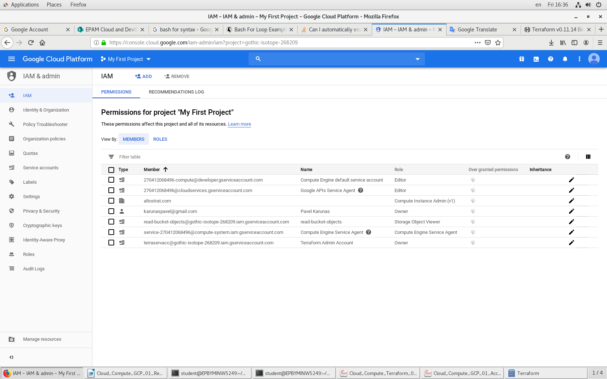
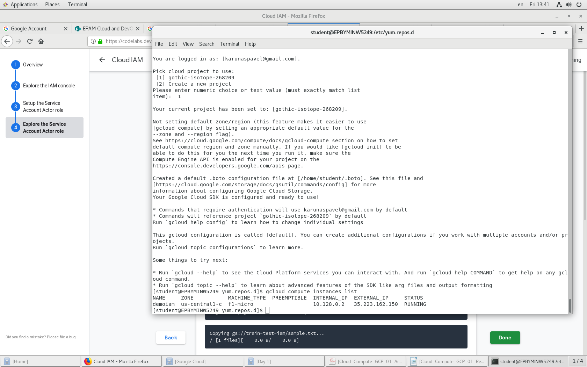
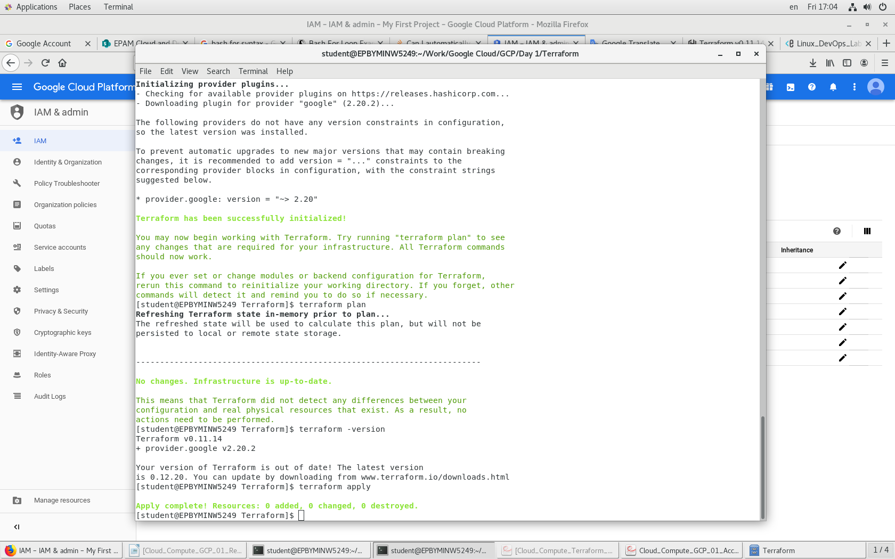

# google-cloud-module

# Pavel_Karunas_Report_1

   1. Registered new Google account

   1. Activated 12 months free tier account at GCP (300$ credit)

   1. Performed Budget configuration

   1. Installed and configured Google SDK (done acording to presentation)

   1. Completed tutorial lab task at “Cloud IAM” https://codelabs.developers.google.com/codelabs/gcp-infra-cloud-iam/index.html?index=..%2F..cloud#0
    1. 

    1. 

   1. Created Service Account for Terraform (done acording to presentation)

   1. Configured terraform to access GCP via Service Account (done acording to presentation)
	
    
	!Screenshots with confiramation can be found in adjacent folder.!

